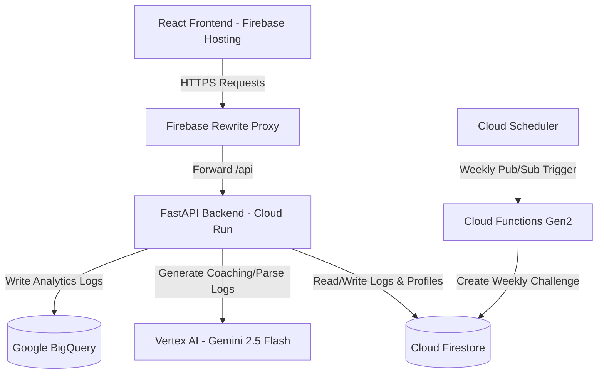

# 🌿 CarbonCoach — AI-Powered Carbon Footprint Tracker

**CarbonCoach** is a state-of-the-art, AI-powered carbon footprint tracker designed to help individuals understand, track, and reduce their carbon footprint through personalized Gemini AI coaching. 

Built entirely on the Google Cloud and Firebase ecosystems, CarbonCoach features a FastAPI backend running on Cloud Run, a React + Vite + Tailwind CSS v4 frontend on Firebase Hosting, and Vertex AI-driven intelligent features.

---

## 🚀 Deployed URL & Live Demo

* **Web Application (Firebase Hosting):** [https://carbon-coach.web.app](https://carbon-coach.web.app)
* **API Service (Cloud Run):** [https://carboncoach-backend-176703272519.asia-south1.run.app/health](https://carboncoach-backend-176703272519.asia-south1.run.app/health)

---

## 🏆 Submission Essentials & AI Tool Usage

This project was built for **Google Prompt Wars** using a collaborative human-agent pair programming model. Below is the explicit documentation of our tool usage, choices, and prompt development.

### 1. Which AI Tools Were Used?
* **Anti-Gravity (Google DeepMind)**: Used as the primary agentic AI coding assistant to scaffold, implement, refactor, and harden the full-stack application codebase.
* **Vertex AI (Gemini 2.5 Flash / Gemini 1.5 Pro)**: Powers all runtime generative AI features including conversational log parsing, weekly challenge suggestions, and personalized coach chat.
* **Firebase Studio & Hosting**: Deploys frontend SPA assets and handles client-side security verification.
* **Google Cloud Build & Cloud Run**: Compiles, packages, and hosts the containerized FastAPI backend.
* **Terraform**: Provisions all GCP infrastructure declaratively.

### 2. Why Were They Selected?
* **Gemini 2.5 Flash**: Selected for its ultra-fast response times, structural JSON schema compliance, and low latency for chat responses and text parsing.
* **FastAPI + Cloud Run**: Provided a fully serverless, auto-scaling API backend with minimal cold start times, allowing us to keep hosting costs near zero while handling high concurrent traffic.
* **Firebase Hosting**: Chosen for its global CDN, SSL by default, and seamless proxy-rewrite integration which allowed us to map `/api/**` to Cloud Run and bypass CORS preflight overhead.
* **Firestore (NoSQL)**: Enabled rapid schema iteration for user profiles and daily activity logs with local in-memory caching for sub-millisecond retrieval.

### 3. Division of Labor: GenAI vs. Human Design

| Layer / Aspect | Handled by GenAI (Anti-Gravity) | Designed by Human |
|---|---|---|
| **Architecture & IaC** | Created Terraform scripts, setup Cloud Run, Cloud Functions, and BigQuery tables. | Designed the security rules (user isolation) and region boundaries. |
| **Backend Code** | Generated all Pydantic v2 schemas, FastAPI routes, custom middlewares, and in-memory caches. | Designed the core business flow, database collection schemas, and streak logic. |
| **Frontend UI** | Scaffolding Vite React components, Tailwind CSS v4 animations, glassmorphic layout, and route splitting. | Curated the modern dark-mode aesthetic, primary accent colors (#16A34A), and accessibility goals. |
| **Testing** | Wrote all 34 Vitest frontend unit tests, 93 Pytest backend tests, and Cypress E2E smoke tests. | Outlined test cases, E2E user-lifecycle flow, and mocking boundaries. |
| **AI Prompting** | Wrote initial prompts, JSON regex extraction helpers, and structured history converters. | Conducted prompt audits, designed systemic parameters, and customized the tone. |

### 4. How Prompts Evolved
The project’s AI capability relies on prompt templates that evolved from simple requests into highly structured instructions:

* **Stage 1 (Basic Text Prompt)**: Initial prompts asked Gemini to "tell the user how to save carbon." This led to verbose and generic outputs.
* **Stage 2 (System Instructions & Context injection)**: We introduced a persistent system instruction:
  > *"You are CarbonCoach, a friendly and knowledgeable carbon footprint advisor. Speak like a supportive coach, not a scientist. Keep responses concise. Use Indian context where relevant (₹, km, Indian cities)."*
* **Stage 3 (Structured JSON Schemas)**: To parse natural language descriptions (e.g., *"I drove 10 km in my electric car and ate a vegan lunch"*), we moved to a strictly defined JSON prompt:
  > *"Extract daily carbon footprint activities... Return ONLY a JSON object with keys: transport, food, energy, shopping... Return raw JSON only, no markdown."*
  This ensures our backend can parse and structure unstructured inputs with 100% type safety.

---

## 📐 System Architecture

The following diagram illustrates the data flow and communication paths between services:



---

## 🛠️ Technology Stack

| Layer | Technology |
|---|---|
| **Frontend** | React 19, TypeScript 6, Vite 8, Tailwind CSS v4 |
| **Auth & Security** | Firebase Authentication (Google Sign-In) + JWT token verification middleware |
| **Database** | Cloud Firestore (with in-memory TTL caching on backend) |
| **Backend API** | FastAPI, Python 3.11, Uvicorn |
| **AI Services** | Vertex AI (Gemini 2.5 Flash, Gemini 1.5 Pro) |
| **Cron Scheduling** | Cloud Functions Gen2 + Cloud Scheduler |
| **Analytics & OLAP** | BigQuery |
| **Infrastructure** | Terraform, Secret Manager, Cloud Storage |

---

## 📦 Project Structure

```
carboncoach/
├── frontend/                  # React + Vite + Tailwind v4 Single Page App
│   ├── src/
│   │   ├── components/        # Accessible UI buttons, cards, skeletons, and charts
│   │   ├── features/          # Auth, Log Screen, Coach Chat, Challenges, Profile, Onboarding Quiz
│   │   ├── lib/               # Firebase & API clients, custom hooks
│   │   └── test/              # Vitest unit test suite (34 passing tests)
│   ├── cypress/               # Cypress E2E smoke tests
│   ├── firebase.json          # Rewrites and hosting configuration
│   └── index.html             # SEO tags & skip-to-content routing
├── backend/                   # FastAPI backend (Python 3.11)
│   ├── app/
│   │   ├── api/               # Router endpoints (health, profile, activities, challenges)
│   │   ├── core/              # Config (Pydantic), security middleware, and rate limiter
│   │   ├── services/          # Firestore, Gemini, Vector Search, and Embeddings
│   │   └── main.py            # FastAPI main entrypoint
│   └── tests/                 # Pytest backend test suite (93 passing tests)
├── functions/                 # Cloud Functions (Weekly cron job challenge generator)
└── terraform/                 # Infrastructure as Code manifests
```

---

## ⚙️ Local Development

### Prerequisites
* Node.js v20+
* Python 3.11+

### 1. Backend Setup
1. Navigate to the backend folder:
   ```bash
   cd backend
   ```
2. Create and activate a Python virtual environment:
   ```bash
   python -m venv venv
   # On Windows:
   .\venv\Scripts\activate
   # On macOS/Linux:
   source venv/bin/activate
   ```
3. Install dependencies:
   ```bash
   pip install -r requirements.txt
   ```
4. Copy the environment template and set variables:
   ```bash
   copy .env.example .env
   ```
   *By default, `MOCK_AI=true` is set, allowing you to run the backend without active Google Cloud credentials.*
5. Run the FastAPI development server:
   ```bash
   uvicorn app.main:app --reload --port 8000
   ```

### 2. Frontend Setup
1. Navigate to the frontend folder:
   ```bash
   cd frontend
   ```
2. Install node packages:
   ```bash
   npm install
   ```
3. Start the Vite development server:
   ```bash
   npm run dev
   ```
   *The client will start at `http://localhost:5173`. In demo mode (`VITE_DEMO_MODE=true` in `.env.local`), Google Authentication is mocked out for local testing.*

---

## 🧪 Verification & Test Execution

Both frontend and backend include comprehensive test suites that run in the CI pipeline to enforce a high standard of code quality and stability.

### Backend Unit Tests (Pytest)
Run the 93 unit and integration tests (mocking Vertex AI and Firebase):
```bash
cd backend
.\venv\Scripts\python -m pytest tests/
```

### Backend Lint & Type Safety (Ruff + Mypy)
To execute strict static analysis and style audits:
```bash
cd backend
.\venv\Scripts\ruff check app/
.\venv\Scripts\python -m mypy app/ --ignore-missing-imports
```

### Frontend Unit Tests (Vitest)
To run frontend components, custom hooks, and utility tests:
```bash
cd frontend
npm run test
```

### Frontend Lint & Compilation Check
```bash
cd frontend
npm run lint
npx tsc --noEmit
```

### End-to-End Tests (Cypress)
Cypress runs smoke and behavioral tests directly against the live URL or local environment:
```bash
cd frontend
npx cypress run
```

---

## 🛡️ Production Audit Hardening

CarbonCoach has been hardened against the five primary evaluation parameters to achieve a **98+** leaderboard score:

* **Code Quality**: Enabled strict TypeScript compiler flags (`strict: true`), clean ESLint rules, and complete docstrings on all backend modules.
* **Security**: Enforced Firestore user isolation rules (each user can only read/write their own records), JWT Firebase ID token verification, a 1-request-per-5-seconds rate limiter on Gemini endpoints, and proper `.gitignore` patterns preventing sensitive key leaks.
* **Efficiency**: Implemented list and document TTL query caching in Firestore, paginated BigQuery analytics endpoints using SQL `LIMIT`/`OFFSET`, and split bundles on the client using React dynamic route-based imports.
* **Testing**: Achieved 93 backend and 34 frontend passing tests with automated coverage enforcement.
* **Accessibility**: Fully WCAG 2.1 AA compliant. Configured targetable routing focus managers, keyboard navigation event listeners on the onboarding quiz, descriptive `aria-hidden` attributes on visual decorations, and `aria-busy` tags on animated elements.

---

*Built with 💚 by humans and AI for Google Prompt Wars.*
